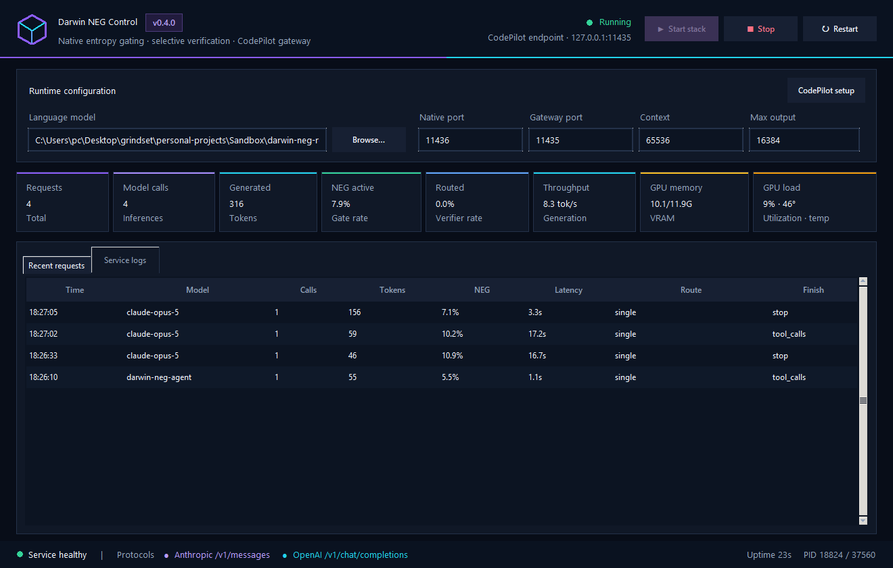

# Darwin-9B-NEG native inference stack

This project serves the Q6_K Darwin-9B-Opus GGUF with the released Darwin NEG
hidden-state head attached inside a patched, Ollama-pinned `llama-server`. A
dual OpenAI Chat Completions and Anthropic Messages routing layer adds
selective candidate generation, evaluator selection, guarded refinement, and
an optional exact 20-call profile for CodePilot and Claude Code clients.

```text
CodePilot / Claude Code
  -> OpenAI + Anthropic router :11435
       -> darwin-neg-agent      (1 call normally; 5 for complex/uncertain steps)
       -> darwin-neg-agent20    (15 candidates + 3 reviews + evaluator + refiner)
       -> native llama-server :11436
            -> Q6_K language model on RTX 5070
            -> released FP32 NEG head on each generated hidden state
```

CodePilot remains responsible for repository tools, checkpoints, compaction,
and the long-horizon task loop. This stack owns inference-time NEG, uncertainty
routing, candidate evaluation, and response refinement.

## Windows controller and installer

`Darwin NEG Control` is the desktop start/stop application for the complete
stack. It launches the patched native runner, waits for the Q6_K model and
released NEG head to become healthy, then exposes the CodePilot-compatible
router. The live dashboard reports aggregate request/call/token counts, routed
request rate, real NEG activation rate, generated-token throughput, GPU memory,
GPU load/temperature, recent request metadata, and service logs. Prompts and
generated text are never retained in telemetry.

The controller records the exact PID, executable path, and Windows process
creation time for both managed services. If the UI is force-closed while the
stack remains alive, the next launch safely adopts only those matching Darwin
processes. A surviving half-stack appears as **Partial** with working **Stop**
and **Restart** actions; Restart first removes the verified orphan before
bringing both services back online. Unrelated processes on the configured ports
are never terminated automatically.



The **CodePilot setup** button opens an offline configuration guide inside the
app. It shows the correct Anthropic base URL (without `/v1`), the separate
OpenAI-compatible URL, API-key behavior, model IDs, context/output limits, and
the distinction between model serving and CodePilot's web-search MCP tools.

The installer and portable build bundle the patched native runtime and the
released 16.8 MB FP32 NEG head. The 6.85 GiB Q6_K GGUF remains an external model
file; select it once in the app and the path is saved under
`%LOCALAPPDATA%\DarwinNEGControl\config.json`. Ollama must be installed because
the native runner reuses its CUDA 12 backend.

Install the desktop build dependency and build the unsigned Windows artifacts
with:

```powershell
python -m pip install -e ".[desktop]"
& .\scripts\build-windows-release.ps1
```

This produces an x64 portable ZIP, a per-user Inno Setup installer, and SHA-256
checksums under `dist`. The binaries are intentionally unsigned, so Windows may
show a SmartScreen warning until a code-signing certificate is applied.

## What is genuinely native NEG here

The runner retrieves Qwen3.5's normalized final hidden state immediately before
the LM head for every generated token. It executes the released sidecar exactly:

1. `Linear(4096 -> 1024)`
2. exact GELU
3. `Linear(1024 -> 1)`
4. softplus predicted entropy
5. activate above the released threshold `1.1751873493`
6. on activation, scale logits by `1 / 0.5983633399` and retain the top 20

The API returns per-request `neg` telemetry: steps, activations, activation
rate, mean/max predicted entropy, guided steps, gate parameters, and head time.
The router uses activation rate to decide when extra inference is warranted.

One upstream limitation is preserved rather than hidden: top-20 masking and a
positive temperature scale cannot change a greedy argmax. Consequently,
token-level NEG changes sampled ensemble candidates, while greedy calls benefit
through real-head telemetry and request-level routing. This is materially
different from the former top-logprob entropy surrogate.

The language model is the imatrix `Q6_K` GGUF and remains fully GPU-resident on
the 12 GB RTX 5070. The 16.8 MB NEG head is FP32 and runs as a vectorized CPU
side-head; it does not cause language-model CPU offload. Stock Ollama cannot
attach an external head or custom per-token processor, so the runnable model is
a patched companion server built against Ollama's exact llama.cpp revision,
while reusing Ollama's installed CUDA backend.

## Pinned components

- Ollama source: `b7871fc0d1d82fe109536efa3e0e8e411c766c75` (v0.32.15)
- llama.cpp source: `9d77fa17254e1dee4b9e92504c91611a60b1359f` (b10488)
- Native patch: `native/llama-b10488-neg.patch`
- NEG binary SHA-256: `c2ca7f61897ab3071afd022bc3bf7c0efa84c25b080d727bf4be4e2a36ff1e2a`
- Current runner SHA-256: `411fe728880087baad30d0e40e2ed0ad6c1e828f697be7428880d21378a8cf57`

The build script checks both source commits before applying the patch. The
native head's deterministic output matches PyTorch within `2.4e-7` absolute
error; the optimized build was also checked separately.

## Build

The required model and released sidecar currently live at:

```text
models/gguf/Darwin-9B-NEG.i1-Q6_K.gguf
models/Darwin-9B-NEG-BF16/neg_modules.safetensors
```

Regenerate the native sidecar when needed:

```powershell
python .\scripts\convert-neg-head.py `
  .\models\Darwin-9B-NEG-BF16\neg_modules.safetensors `
  .\models\neg-head.fp32.bin
```

Build the pinned runner and package its DLLs under `runtime/native-neg`:

```powershell
& .\scripts\build-native-neg.ps1
```

The script uses a short build path under `%LOCALAPPDATA%\DarwinNEG` to avoid
Windows path-length failures. It requires Git, CMake, a C++ compiler, and
Ollama 0.32.15's installed CUDA 12 backend.

## Start the CodePilot stack

Start both layers with one command:

```powershell
& .\scripts\start-codepilot-stack.ps1
```

The native server binds only to `127.0.0.1:11436`; the router binds to
`127.0.0.1:11435`. The combined script runs the native helper hidden, keeps the
router in the foreground, and stops the helper when the foreground process
exits. To run them separately:

```powershell
& .\scripts\start-native-neg.ps1
& .\scripts\start-native-router.ps1
```

Health and model discovery:

```powershell
Invoke-RestMethod http://127.0.0.1:11436/health
Invoke-RestMethod http://127.0.0.1:11435/health
Invoke-RestMethod http://127.0.0.1:11435/v1/models
```

## CodePilot configuration

For Claude Code runtime, Anthropic third-party provider, and maintained web
search setup, follow [CODEPILOT-CLAUDE-SETUP.md](CODEPILOT-CLAUDE-SETUP.md).

The Anthropic base URL is `http://127.0.0.1:11435` and accepts
`POST /v1/messages` plus `POST /v1/messages/count_tokens`. It translates system
blocks, thinking blocks, tool schemas, `tool_use`, `tool_result`, tool choice,
parallel-tool control, stop sequences, and Anthropic SSE events onto the same
Darwin NEG router used by the OpenAI endpoint. `x-api-key` and Bearer
authentication are both accepted when `DARWIN_API_KEY` is configured.

### CodePilot native/OpenAI runtime

In CodePilot, open **Settings -> Providers -> Add Provider -> Custom API
(OpenAI-compatible)** and use:

| Field | Automatic profile | Full profile |
|---|---|---|
| Base URL | `http://127.0.0.1:11435/v1` | same |
| API key | `EMPTY` | same |
| Model Name | `darwin-neg-agent` | `darwin-neg-agent20` |
| Context | `65536` | `65536` |
| Output allowance | `16384` | task appropriate, up to `16384` by default |
| Temperature | `0` | candidates are routed internally |

`darwin-neg-agent` preserves CodePilot `tools`, `tool_choice`,
`parallel_tool_calls`, stop sequences, seeds, presence/frequency penalties, and
the llama.cpp `repeat_penalty` extension. Thinking stays enabled by default.
Streaming requests are accepted; because routing needs complete candidates,
the final result is emitted as a buffered SSE chunk. `Darwin-NEG` is also
advertised as a compatibility alias for clients that preserve a display-name
model ID. Streamed tool calls include the required numeric `index` field used by
CodePilot's OpenAI event validator.

## Routing and refinement

The automatic profile begins with one deterministic response. It expands to
three role-diverse candidates plus one evaluator and one final refiner when any
of these are true:

- a new repository task matches at least three complexity concerns;
- released-head activation rate is at least 5% across at least 16 active steps;
- the answer expresses explicit uncertainty;
- the proposed tool is high-impact; or
- the caller sets `ensemble` explicitly.

Valid selected tool calls are immutable across refinement unless the refiner
emits the same function names and parsed arguments. This prevents an evaluator
from turning a correct tool action into prose. The 20-call profile spends
exactly 15 candidate calls, three specialist reviews, one evaluator, and one
refiner. Use it for architecture, difficult debugging, migration plans, or
final verification—not every tool round.

For a custom one-off budget:

```json
{
  "model": "darwin-neg-agent",
  "messages": [{"role": "user", "content": "Investigate this failure."}],
  "ensemble": 8,
  "max_tokens": 16384
}
```

The separate GPQA reconstruction uses choice-order permutations, critics, and
arbiters. Its adaptive 3–1 path now uses guarded consensus: disagreeing late
reviewers cannot erase three independent permutation votes, while two reviewers
that agree on one alternative may resolve a tied reviewed panel.

## Validation evidence

Current local results on Ryzen 5 7600X + RTX 5070 12 GB:

| Check | Result |
|---|---|
| Native/PyTorch head parity | absolute error <= `2.4e-7` |
| Unit/integration tests | `38 passed` |
| Executable coding micro-suite | `3/3` |
| Forced exact-schema tool calls | `3/3` |
| Native-head throughput case | `74.96 tok/s` (512 generated tokens) |
| Controlled head/no-head comparison | `69.43` vs `72.51 tok/s` (~4.3% cost) |
| Side-head compute, controlled run | `0.633 ms/token` |
| Live automatic refinement | 5 calls completed in `72.68 s` at a deliberately small 1K cap |
| GPQA guarded-evaluator regression | `1/1`, six calls, `110.1 s` |

The coding/tool/performance record is in
`benchmarks/results/native-agent-validation.json`; the GPQA record is in
`benchmarks/results/native-neg-smoke-adaptive20-guarded.jsonl`.

The GPQA result is a one-question regression check, not an estimate of
GPQA-Diamond accuracy and not evidence for the upstream 84.34% claim. A full
198-question adaptive or fixed-20 run is required before making any aggregate
claim. The exact FINAL-Bench evaluator remains unpublished; this project's
protocol is intentionally transparent and versioned.

Run all local tests and the validation suite with:

```powershell
python -m pytest -q
python .\benchmarks\native_agent_validation.py `
  --output .\benchmarks\results\native-agent-validation.json

python .\benchmarks\gpqa_reconstruction.py `
  --backend native `
  --model darwin-9b-neg-native `
  --mode adaptive20 `
  --limit 1 `
  --output .\benchmarks\results\native-neg-smoke.jsonl
```

The public GPQA dataset is pinned to revision
`68be7564497676e07a77a042fdb587deb88c51c3` and all 198 rows validate. Reference
answers are read only after inference for scoring and are never placed in
solver, critic, juror, or arbiter prompts.

## Upstream audit

`UPSTREAM-AUDIT.md` records the released checkpoint layout and the limitations
of the upstream model/evaluator claims. In particular, the public language
checkpoint and GGUF do not embed the NEG side-head, the upstream greedy top-k
gate cannot change argmax, and the exact claimed 84.34% evaluation procedure is
not included. This implementation attaches the head that is actually released
and reports only locally reproducible evidence.
